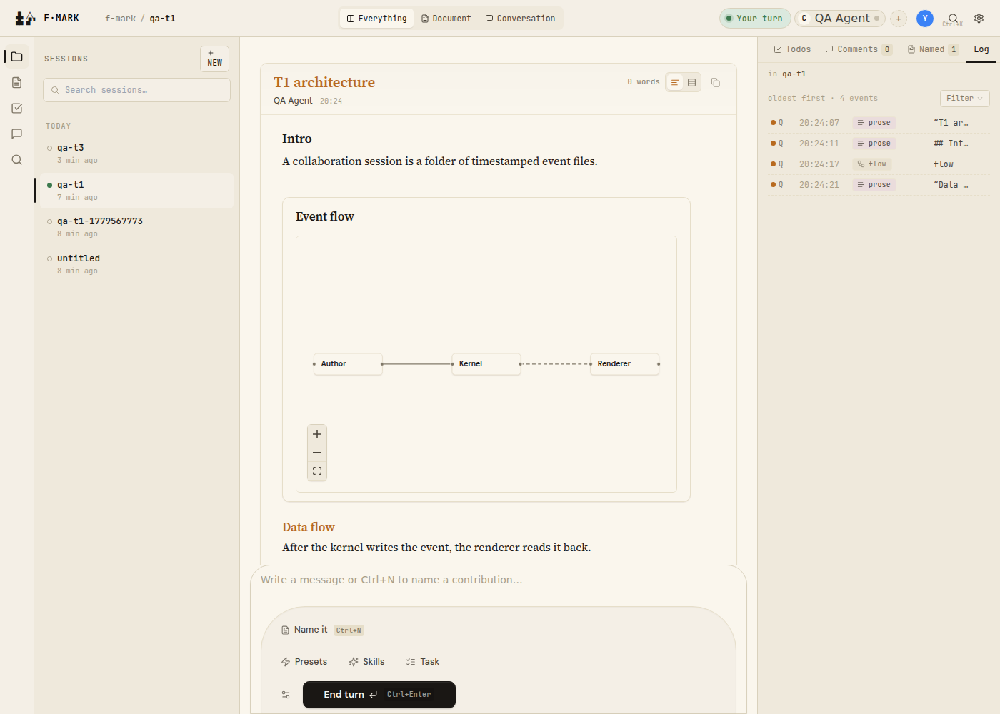

# T1 — Canonical four-event document

## Setup verified

- Kernel running on port 7777 (via `node dist/index.js` — see BUG-1 re: `pnpm dev` failure).
- Session: `2026-05-23-qa-t1` (slug: `qa-t1`).
- Participant: `ag-qa` (registered via `POST /participants/register`).

## Steps run

1. `POST /sessions/2026-05-23-qa-t1/events/prose`
   - Body: `{"participant_id":"ag-qa","name":"T1 architecture","content":""}`
   - Response: `{"filename":"20260523T202407Z_ag-qa.prose.md","kind":"prose"}`
   - **ANCHOR** = `20260523T202407Z_ag-qa.prose.md`

2. `POST /sessions/2026-05-23-qa-t1/events/prose`
   - Body: `{"participant_id":"ag-qa","append_to":"<ANCHOR>","content":"## Intro\n\nA collaboration session is a folder of timestamped event files."}`
   - Response: `{"filename":"20260523T202411Z_ag-qa.prose.md","kind":"prose"}`

3. `POST /sessions/2026-05-23-qa-t1/events/flow`
   - Body: `{"participant_id":"ag-qa","id":"fl_t1","title":"Event flow","append_to":"<ANCHOR>","nodes":[...],"edges":[...]}`
   - Response: `{"filename":"20260523T202417Z_ag-qa.flow.json","kind":"flow"}`

4. `POST /sessions/2026-05-23-qa-t1/events/prose`
   - Body: `{"participant_id":"ag-qa","name":"Data flow","append_to":"<ANCHOR>","content":"After the kernel writes the event, the renderer reads it back."}`
   - Response: `{"filename":"20260523T202421Z_ag-qa.prose.md","kind":"prose"}`

5. Navigated to session in browser; clicked `qa-t1` in session list.

## Expected vs actual

| Check | Expected | Actual | Pass/Fail |
|---|---|---|---|
| Exactly 1 `.prose-card` for "T1 architecture" | 1 | 1 | PASS |
| 3 embed frames inside card (prose, flow, prose) | 3 | 3 | PASS |
| Block order: `["prose","flow","prose"]` | `["prose","flow","prose"]` | `["prose","flow","prose"]` | PASS |
| No `.flow-head` on embedded flow | 0 | 0 | PASS |
| `.prose-block-name` h3 with text "Data flow" | 1, "Data flow" | 1, "Data flow" | PASS |
| Word-count badge updates from block content | >0 words | "0 words" | **FAIL** |
| No standalone `.flow-card` in feed | 0 | 0 | PASS |
| `[data-event-kind="prose-named"]` count = 1 | 1 | 1 | PASS |
| `.flow-card-embedded` count = 1 | 1 | 1 | PASS |
| Feed has 0 standalone `[data-event-kind="flow"]` | 0 | 0 | PASS |
| No console errors | 0 | 0 | PASS |
| All 4 POSTs return 200 with filename | 4/4 | 4/4 | PASS |

## Evidence

- 

### DOM queries (run on `qa-t1` session with new renderer)

```js
document.querySelectorAll('[data-event-kind="prose-named"]').length
// => 1  ✓

document.querySelectorAll('.flow-card-embedded').length
// => 1  ✓

document.querySelectorAll('[aria-label="Feed"] [data-event-kind="flow"]:not(.flow-card-embedded)').length
// => 0  ✓  (feed only; the log-row in right panel has data-event-kind="flow" but is NOT in feed)

document.querySelectorAll('.prose-embed-frame').length
// => 3  ✓

Array.from(document.querySelectorAll('.prose-embed-frame')).map(el => el.getAttribute('data-block-kind'))
// => ["prose", "flow", "prose"]  ✓

document.querySelector('.prose-meta-words')?.textContent
// => "0 words"  ✗ (should count words from prose blocks)

document.querySelectorAll('.flow-head').length
// => 0  ✓ (no .flow-head chrome on embedded flow)

document.querySelectorAll('.prose-block-name').length
// => 1  ✓

Array.from(document.querySelectorAll('.prose-block-name')).map(el => el.textContent)
// => ["Data flow"]  ✓
```

### Console

No errors on the qa-t1 page (1 transient WebSocket warning from kernel restart, not from this session's use).

## Bugs found

### BUG-1 — `pnpm dev` (tsx from source) fails: `MAX_ATTACHMENT_BYTES` not exported from `files.ts`

- Severity: P0 (blocks `pnpm dev` entirely — kernel cannot start from source)
- Where: `packages/kernel/src/routes/files.ts` (missing export) and `packages/kernel/src/server.ts:13` (imports it)
- Trigger: Running `pnpm -F f-mark dev` or any `tsx src/index.ts` invocation
- Expected: Kernel starts; `MAX_ATTACHMENT_BYTES` exported from `files.ts` (it IS present in the older compiled `dist/routes/files.js` as `export const MAX_ATTACHMENT_BYTES = 50 * 1024 * 1024`)
- Actual: `SyntaxError: The requested module './routes/files.js' does not provide an export named 'MAX_ATTACHMENT_BYTES'`
- Suggested fix: Add `export const MAX_ATTACHMENT_BYTES = 50 * 1024 * 1024;` to `packages/kernel/src/routes/files.ts`, or move the import in `server.ts` to a local constant

### BUG-2 — Word-count badge shows "0 words" despite prose blocks with text

- Severity: P2 (visual defect — doc appears empty but is not)
- Where: `packages/renderer/src/cards/ProseCard.tsx` (word-count derivation)
- Trigger: Compose a named anchor + prose blocks via `append_to`; view in browser
- Expected: Word-count badge (`.prose-meta-words`) shows the sum of words in all prose embed blocks (intro block has ~14 words, Data flow block has ~12 words = ~26 words)
- Actual: "0 words" — the word count logic only counts words from the anchor's own `content` field (empty), not from the `blocks` array
- Suggested fix: In `ProseCard`, sum words across all prose-kind blocks in `consumedBlocksByAnchor`, not just the anchor's `payload.content`

### Note on test spec query

The test definition uses `document.querySelectorAll('[data-event-kind="flow"]:not(.flow-card-embedded)').length` to check for standalone flows, but this query also matches the log-row entries in the right panel (which carry `data-event-kind="flow"`). The correct scoped query is `document.querySelectorAll('[aria-label="Feed"] [data-event-kind="flow"]:not(.flow-card-embedded)').length` which correctly returns 0. This is a test-spec issue, not a product bug.
