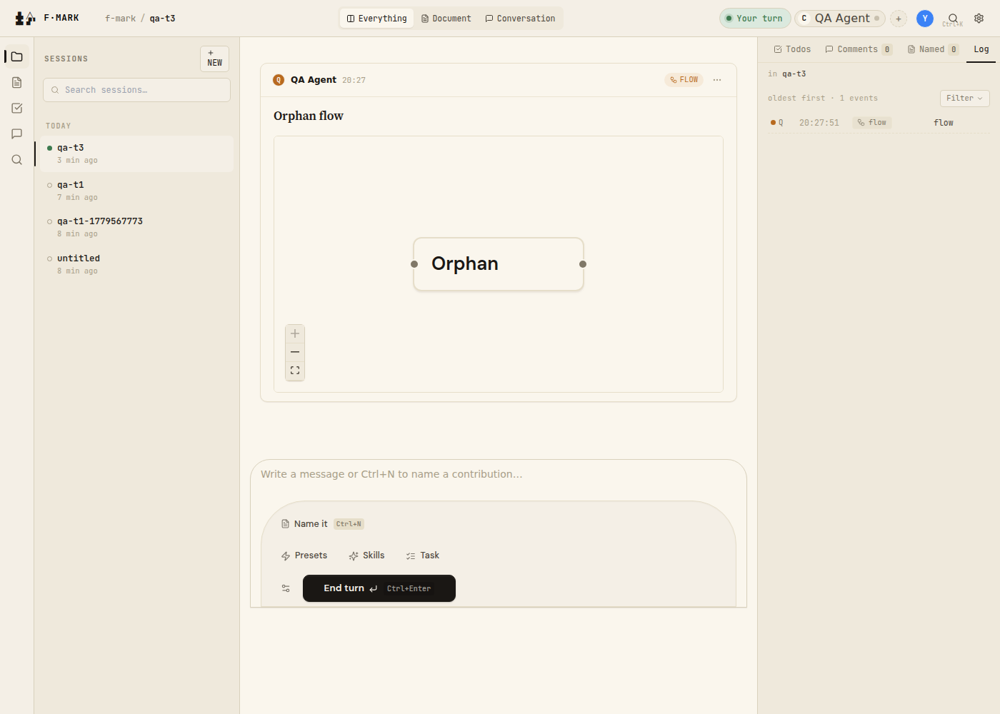

# T3 — Orphan block

## Setup verified

- Kernel running on port 7777.
- Session: `2026-05-23-qa-t3` (slug: `qa-t3`).
- Participant: `ag-qa`.

## Steps run

1. `POST /sessions/2026-05-23-qa-t3/events/flow`
   - Body: `{"participant_id":"ag-qa","id":"fl_orphan","title":"Orphan flow","append_to":"20990101T000000Z_ag-nobody.prose.md","nodes":[{"id":"x","label":"Orphan"}],"edges":[]}`
   - `append_to` is a deliberately fake/non-existent anchor filename.
   - Response: `{"filename":"20260523T202751Z_ag-qa.flow.json","kind":"flow"}`

2. Navigated to `2026-05-23-qa-t3` session in browser.

## Expected vs actual

| Check | Expected | Actual | Pass/Fail |
|---|---|---|---|
| Flow appears as top-level `.flow-card` in feed | 1 | 1 | PASS |
| No prose-card with this anchor | 0 | 0 | PASS |
| No console errors | 0 | 0 | PASS |
| Orphan flow title visible | "Orphan flow" | "Orphan flow" | PASS |
| Orphan badge/indicator visible on card | badge present | no badge (0 `.orphaned-embed`) | **FAIL (P3)** |

## Evidence

- 

### DOM queries

```js
// Feed-scoped top-level flow card count
document.querySelector('[aria-label="Feed"]').querySelectorAll('.flow-card:not(.flow-card-embedded)').length
// => 1  ✓ (orphan renders as standalone top-level flow card)

document.querySelectorAll('.prose-card').length
// => 0  ✓ (no prose-card with this fake anchor)

// Check orphan badge
document.querySelectorAll('.orphaned-embed, .orphan-badge, [class*="orphan"]').length
// => 0  ✗ (plan says orphans get "orphaned embed" badge; none present)

// Flow title visible
document.querySelector('[aria-label="Feed"] .flow-title').textContent
// => "Orphan flow"  ✓
```

### Console

No errors. Single transient WebSocket warning from kernel startup.

## Bugs found

### BUG-3 — Orphan block renders without "orphaned embed" badge

- Severity: P3 (UX gap — orphaned blocks silently look like normal top-level cards)
- Where: `packages/renderer/src/cards/EventCard.tsx` (orphan badge prop) and/or `packages/renderer/src/cards/FlowCard.tsx`
- Trigger: POST a flow event with `append_to` pointing at a non-existent anchor filename
- Expected: The card renders at top level (correct) AND shows a visual "orphaned embed" badge indicating the referenced anchor doesn't exist
- Actual: Card renders at top level without any orphan indicator; indistinguishable from a normal top-level flow card
- Suggested fix: In `EventCard.tsx`, pass `orphanedAppendTo` prop to the card renderer; add a small badge/indicator in `FlowCard` (and other card types) when `orphanedAppendTo` is set — as described in `plan.md` under "Dispatch"
